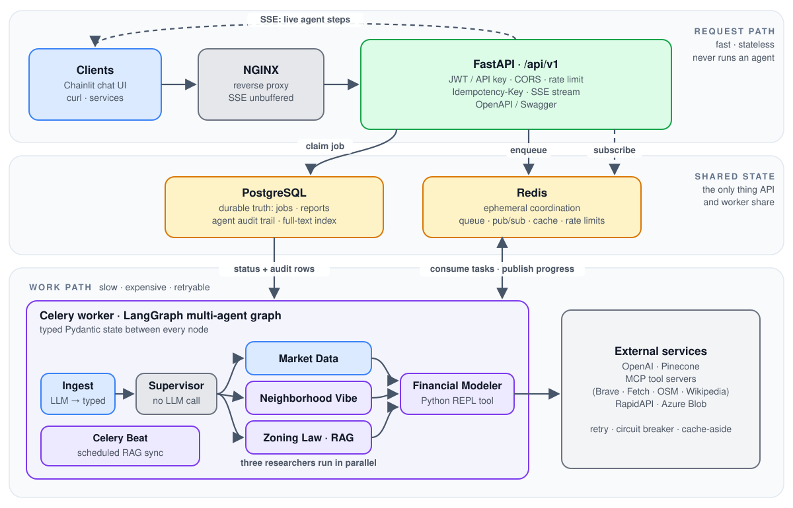
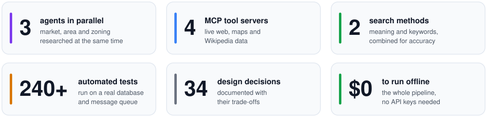

<div align="center">

# 🏢 Real Estate AI Investment Planner

### A multi-agent AI system, engineered like a production service

Turn a plain-English investment goal into an investor-grade property report. Specialist agents built with **LangGraph** research the market, the neighborhood and the zoning rules **in parallel**, using live tools from **MCP servers** and a **hybrid RAG** knowledge base. A **FastAPI · PostgreSQL · Redis · Celery** backend keeps it **resilient, cost-efficient and secure**, and **Docker, Terraform and Kubernetes (AKS)** take it to the cloud.

[](https://github.com/marekpdev/RealEstateApp/actions/workflows/deploy.yml)


**[🌐&nbsp;Live demo](https://realestateapp.marekpdev.com/)** &nbsp;·&nbsp; **[🎬&nbsp;Video](#demo)** &nbsp;·&nbsp; **[🧰&nbsp;Tech stack](#tech-stack)** &nbsp;·&nbsp; **[✨&nbsp;Features](#features)** &nbsp;·&nbsp; **[💰&nbsp;Cost optimization](#cost-optimization)** &nbsp;·&nbsp; **[🚀&nbsp;Run it](#quickstart)** &nbsp;·&nbsp; **[📚&nbsp;Docs](#documentation)** &nbsp;·&nbsp; **[💼&nbsp;LinkedIn](https://www.linkedin.com/in/marekpszczolka94/)**

</div>

---

<div align="center">
<picture>
  <source media="(prefers-color-scheme: dark)" srcset="docs/images/architecture-dark.svg">
  
</picture>
<sub>The full architecture, request lifecycle and failure behaviour: <a href="docs/ARCHITECTURE.md">docs/ARCHITECTURE.md</a></sub>
</div>

<br>

<p align="center">
  <picture>
    <source media="(prefers-color-scheme: dark)" srcset="docs/images/highlights-dark.svg">
    
  </picture>
</p>

> **Type a plain-English investment goal** (*"I'd like to invest in Austin, TX with a $900k budget"*) and a team of specialised agents goes to work. Three research at the same time (one prices the market from live listings, one profiles the neighborhood, one digs through municipal zoning law), then an underwriting agent computes cap rate and cash-on-cash return and writes an investor-grade report. **You watch every agent work, live.**

<a id="tech-stack"></a>

## 🧰 Tech stack

| 🤖 **AI & agents** | 🏗️ **Backend & data** | ☁️ **Cloud & DevOps** |
|:--|:--|:--|
| ✅ LangGraph | ✅ Python 3.12 | ✅ Docker (multi-stage) |
| ✅ LangChain | ✅ FastAPI | ✅ Docker Compose |
| ✅ OpenAI API | ✅ REST + OpenAPI / Swagger | ✅ NGINX |
| ✅ Model Context Protocol (MCP) | ✅ Server-Sent Events | ✅ GitHub Actions CI/CD |
| ✅ RAG pipeline | ✅ Celery + Celery Beat | ✅ GitHub Container Registry |
| ✅ Pinecone vector database | ✅ PostgreSQL 16 | ✅ Terraform (infrastructure as code) |
| ✅ Hybrid search (Reciprocal Rank Fusion) | ✅ SQLAlchemy 2.0 (async) | ✅ Kubernetes |
| ✅ Structured output (Pydantic) | ✅ Alembic migrations | ✅ Azure Kubernetes Service (AKS) |
| ✅ Retrieval evaluation (recall, MRR, nDCG) | ✅ Redis 7 | ✅ Azure Blob Storage |

| 🛡️ **Reliability** | 🔐 **Security** | 🧪 **Quality** |
|:--|:--|:--|
| ✅ Retries with jitter | ✅ JWT and API keys | ✅ pytest on real Postgres and Redis |
| ✅ Circuit breakers | ✅ Rate limiting (token bucket) | ✅ Concurrency (race-condition) tests |
| ✅ Idempotency keys | ✅ CORS allow-list | ✅ Migration drift test |
| ✅ Dead-letter queue | ✅ bcrypt password hashing | ✅ Offline mode: no paid calls in tests |
| ✅ Caching with stampede protection | ✅ Non-root containers | ✅ A mock twin for every agent |
| ✅ Graceful shutdown | ✅ Secrets kept out of the code | ✅ CI on every push |

<a id="demo"></a>

## 🎬 See it in action

<video src="https://github.com/user-attachments/assets/e4cf66d4-9918-41ad-977a-a42407e43d1b" controls width="100%">
  Your browser does not support the video tag.
</video>

<a id="features"></a>

## ✨ Key features

Every feature below is built, tested against real infrastructure and documented together with the reasoning behind it. Plain language first, technical terms in brackets.

### 🤖 The AI

- **Faster research, in parallel.** Three specialist agents investigate the market, the neighborhood and the zoning rules at the same time, then a fourth combines their findings into one report (LangGraph, parallel fan-out and fan-in).
- **Reliable hand-offs.** Each agent passes its findings to the next in a strict, validated format, which keeps the whole pipeline predictable from start to finish (Pydantic).
- **Real-world data through MCP.** Agents look things up on the live web, maps and Wikipedia using the Model Context Protocol (MCP), the open standard for plugging tools into AI. Adding another source is a single configuration entry, and one central gateway keeps tool answers short so runs stay fast and affordable.
- **Answers grounded in real documents.** The zoning agent answers from a library of municipal documents using two search methods that work well together: one understands meaning, the other matches exact terms such as ordinance numbers (hybrid RAG: Pinecone vector search and PostgreSQL full-text search, merged with Reciprocal Rank Fusion; enabled with one setting).
- **Search quality you can prove.** A built-in test bench scores how well each search method finds the right passage (recall, MRR, nDCG). It showed that keyword search alone misses answers worded differently from the document, which is why the two methods are combined.
- **Accurate numbers.** The AI writes the report, but the maths (statistics, cap rate, returns) is done by code rather than guessed by the model, which also saves cost (deterministic tools).
- **Keeps going when a tool is down.** If a data source or the document library is unavailable, the agent is told in plain words and takes another route, such as web search, so the report still gets finished (graceful degradation).

### 🛡️ Dependable in production

- **Fast responses, heavy work in the background.** The API replies immediately while background workers do the slow AI work, and failed steps are retried automatically with nothing silently lost (FastAPI, Celery, retries with backoff, dead-letter queue).
- **No duplicate work, no double billing.** If a request is sent twice, or a message is delivered twice, the job still runs, and is paid for, only once (idempotency keys and atomic claims: "exactly-once effect").
- **Copes with unreliable third parties.** When an outside service is slow or down, the system backs off, stops calling a service that keeps failing, and reuses recent answers (jittered retries, circuit breakers, caching).
- **Live progress.** Users watch each agent work as it happens, and someone who joins late still sees the whole run (Server-Sent Events).
- **Secure by default.** Logins and API keys, request limits per user, strict rules on which websites may call the API, containers that run without admin rights, and no secrets stored in the code (JWT, API keys, rate limiting, CORS allow-list, non-root containers).
- **Data you can trust.** Everything is stored in one reliable database with a full audit trail of what each agent did, and database changes are versioned and checked automatically (PostgreSQL, Alembic migrations, drift test).
- **Proven by tests.** 240+ automated tests run against a real database and message queue, including tests that deliberately race two workers against each other, and they run on every code change (pytest, CI).

### ☁️ Cloud and delivery

- **Runs the same everywhere.** The app is packaged in containers that run without admin rights, and starts locally with a single command (Docker, Docker Compose, NGINX).
- **Automatic quality gate.** Every code change is tested against real services, then built and published automatically (GitHub Actions, GitHub Container Registry).
- **Cloud set-up as code.** The Azure cluster is created from version-controlled scripts, so it can be rebuilt or removed with a command (Terraform, Azure Kubernetes Service; see [Cloud and Kubernetes](#cloud)).

<a id="cost-optimization"></a>

## 💰 Cost optimization

AI bills grow through long prompts, repeated calls and runaway loops. Each source of waste is handled separately:

| 💸 Business benefit | 🔧 How it is achieved |
|:--|:--|
| 🪙 **Lower cost per report** | Every model call uses a small, inexpensive model, and steps that need no AI (routing, statistics, arithmetic) are plain code |
| ✂️ **No surprise bills from long prompts** | Tool output is capped (page fetches default to 2,000 characters, web search to 3 results), agents have explicit search budgets, and retrieval passes on only the top 3 passages |
| 🧠 **Repeat questions cost nothing** | Market data is cached for 15 minutes, and simultaneous identical lookups collapse into one paid call |
| 🌀 **No runaway spending when something goes wrong** | Retries have an attempt and a time budget, a circuit breaker stops calling a failing vendor, and every agent loop has a step limit |
| 🧾 **One request, one bill** | A repeated request returns the existing job, and a redelivered message cannot run the paid agents a second time |
| 🧪 **Free development and testing** | An offline mode blocks every paid call at the network layer, so the whole pipeline and test suite run at zero cost |
| ☁️ **A small cloud bill** | One small cluster node that can be stopped between demos, and capped cache memory |

**Next savings**, each with the reason it is not built yet: matching each task to a right-sized model, reusing whole reports for identical requests, skipping unchanged documents when the knowledge base refreshes, and tracking tokens and cost per run so every saving can be measured. → [docs/COST_OPTIMIZATION.md](docs/COST_OPTIMIZATION.md)

<a id="cloud"></a>

## ☁️ Cloud and Kubernetes (AKS)

The app is designed to run on **Kubernetes**, the standard system for running applications in the cloud: it starts them, restarts them if they fail, and adds capacity when demand grows. The repository includes the code to set this up on **Azure Kubernetes Service (AKS)**. The demo cluster is deliberately one small server to keep the bill low. Here is what exists, and what a production setup that must never go down would add:

| | ✅ In this repository | 🔜 For production high availability |
|:--|:--|:--|
| 🖥️ **Servers** | An Azure Kubernetes cluster created from code, kept to one small server to save money (Terraform, AKS) | Three or more servers spread across separate data-centre zones, growing and shrinking with demand (availability zones, autoscaler) |
| 📦 **The app** | Resource limits, secrets kept outside the code, time to finish running jobs before a restart, and health-check endpoints (`/health`, `/health/ready`) | Several copies behind the load balancer, automatic scaling, the health checks wired in, and dedicated background-worker and scheduler deployments |
| 🗄️ **Data** | PostgreSQL and Redis run alongside the app in Docker Compose | Fully managed, zone-redundant PostgreSQL and Redis from Azure |
| 🚚 **Releases** | Tests run automatically, the image is published automatically, and the rollout is a deliberate manual command (GitHub Actions, `kubectl apply`) | Hands-off, audited rollouts driven from Git, secrets held in a vault, and HTTPS at the edge (GitOps, Key Vault, ingress with TLS) |

The code is already cloud-friendly: the web tier keeps no state of its own, reports its own health, finishes in-flight work before shutting down, runs without admin rights, takes all its settings from the environment, and runs its scheduler as exactly one copy (stateless web tier, liveness and readiness endpoints, graceful `SIGTERM`, non-root user). → [Cloud and Kubernetes in the architecture guide](docs/ARCHITECTURE.md#cloud-and-kubernetes) · [Deployment runbook](docs/DEPLOYMENT.md)

<a id="quickstart"></a>

## 🚀 Run it in 60 seconds

No API keys, no cost: the defaults run the entire pipeline (queue, worker, audit trail, live stream) with deterministic mock agents.

```bash
git clone https://github.com/marekpdev/RealEstateApp.git && cd RealEstateApp
cp .env.example .env          # OFFLINE_MODE=true: zero credentials, zero spend
docker compose up --build     # postgres · redis · migrations · API + UI · worker · beat · nginx
```

Open **http://localhost:8080** and try *"I would like to invest in Austin, TX with a max budget of $900,000."* The interactive API docs (Swagger UI) are at **http://localhost:8080/docs**.

<details>
<summary><b>Or talk to the API directly</b> (needs <code>jq</code>)</summary>

```bash
TOKEN=$(curl -s localhost:8080/api/v1/auth/login -H 'Content-Type: application/json' \
  -d '{"email":"demo@realestateapp.local","password":"demo-password-123"}' | jq -r .access_token)

curl -s localhost:8080/api/v1/reports -H "Authorization: Bearer $TOKEN" \
  -H 'Content-Type: application/json' -H "Idempotency-Key: demo-$(date +%s)" \
  -d '{"query":"Austin, TX, max budget $900,000"}'     # → 202 Accepted + a job id
```

Then follow the job live with `curl -N -H "Authorization: Bearer $TOKEN" localhost:8080/api/v1/reports/<id>/stream`. The full walkthrough is in [docs/API.md](docs/API.md).

</details>

To run against real models and data (OpenAI, RapidAPI, Pinecone, Brave), or to develop locally with `uv`, see [docs/GETTING_STARTED.md](docs/GETTING_STARTED.md).

<a id="documentation"></a>

## 📚 Documentation

| 👀 If you are... | Start with |
|:--|:--|
| a recruiter or hiring manager | this page, the video above, and [Cost optimization](docs/COST_OPTIMIZATION.md) |
| an engineer reviewing the design | [Architecture](docs/ARCHITECTURE.md), then [Engineering decisions](docs/ENGINEERING_DECISIONS.md) |
| an AI engineer | [Agentic AI design](docs/AGENTIC_AI.md) |
| someone who wants to run it | [Getting started](docs/GETTING_STARTED.md) |

| Document | What it covers |
|:--|:--|
| 🏛️ [**Architecture**](docs/ARCHITECTURE.md) | System design, request and job lifecycles, exactly-once effect, live streaming, reliability and failure behaviour, data model, security, cloud and Kubernetes |
| 🧠 [**Agentic AI design**](docs/AGENTIC_AI.md) | The agent graph, MCP tooling, hybrid RAG, retrieval evaluation, guardrails, production hardening |
| 💰 [**Cost optimization**](docs/COST_OPTIMIZATION.md) | Every cost lever in plain language, and what to optimize next |
| ⚖️ [**Engineering decisions**](docs/ENGINEERING_DECISIONS.md) | 34 decisions: what was chosen, why, what was rejected, what it costs |
| 🔌 [**API reference**](docs/API.md) | Endpoints, auth, idempotency, rate limits, the SSE protocol, Swagger UI, a verified curl walkthrough, and an [OpenAPI snapshot](docs/openapi.json) |
| 🚀 [**Getting started**](docs/GETTING_STARTED.md) | Docker Compose, local development, configuration, going live, fault injection |
| 🧪 [**Testing**](docs/TESTING.md) | Strategy, the harness, what is and is not covered |
| ☁️ [**Deployment**](docs/DEPLOYMENT.md) | Azure runbook: Terraform, AKS, secrets, cost hibernation |
| 📂 [**Project structure**](docs/PROJECT_STRUCTURE.md) | Where everything lives, and where to start reading |

<a id="whats-next"></a>

## 🔮 What's next

- **Observability.** Integration of LangSmith or Arize Phoenix for deeper multi-agent trace analysis, execution monitoring and evaluation.
- **Agentic self-correction.** A "critique" loop where the supervisor validates agent outputs against the initial user request.
- **Multi-model fallbacks.** Automatically switching to alternative providers (for example Anthropic or local models) during API outages or rate limits.

The engineering-level plans behind these, and the rest of the production-hardening list, are in [Production hardening](docs/AGENTIC_AI.md#production-hardening) and [Cloud and Kubernetes](docs/ARCHITECTURE.md#cloud-and-kubernetes).

<div align="center">

Built by [@marekpdev](https://github.com/marekpdev) &nbsp;·&nbsp; [💼 Connect on LinkedIn](https://www.linkedin.com/in/marekpszczolka94/)

<sub>A portfolio project. Reports are generated by AI for demonstration and are not financial advice.</sub>

</div>
