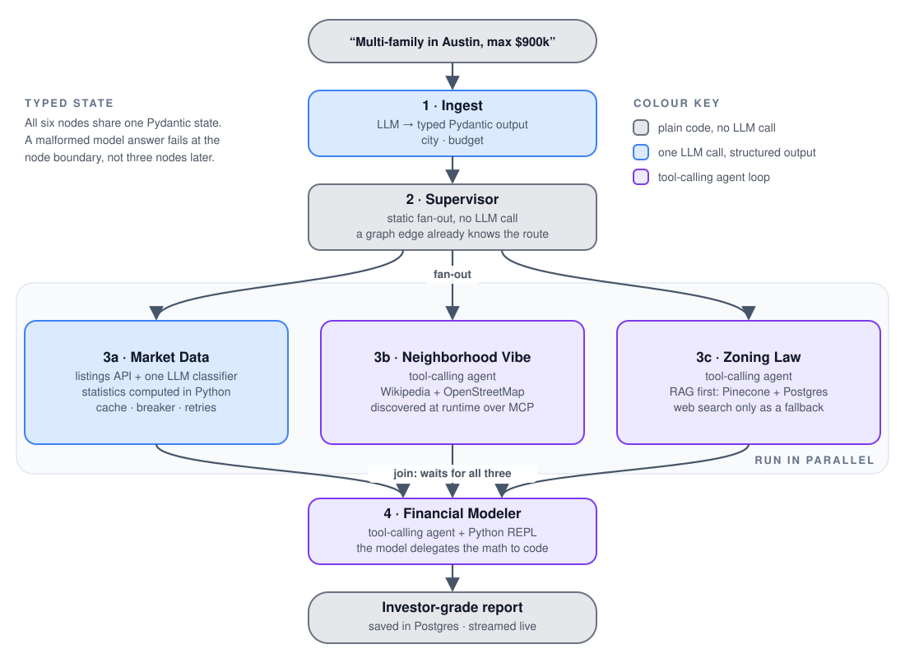
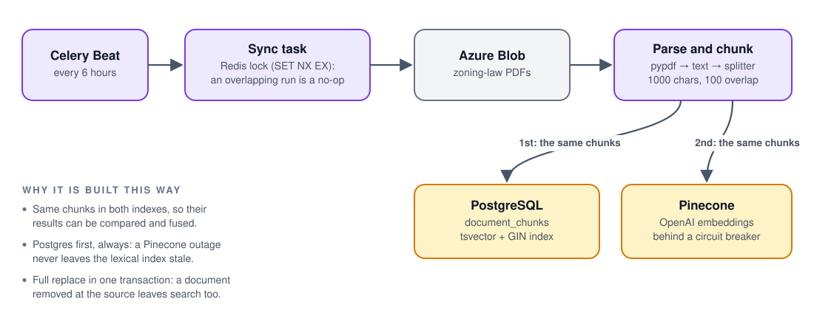
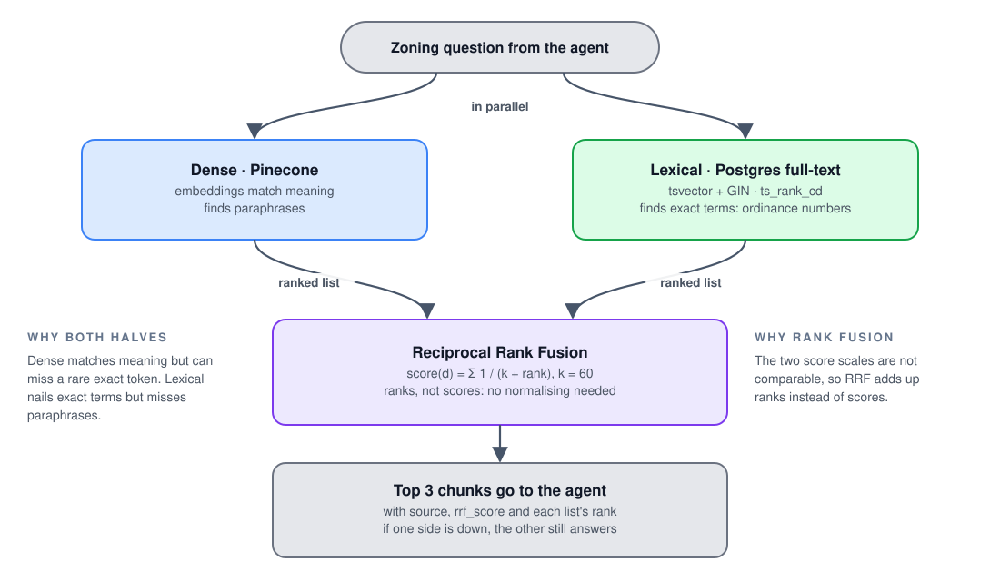
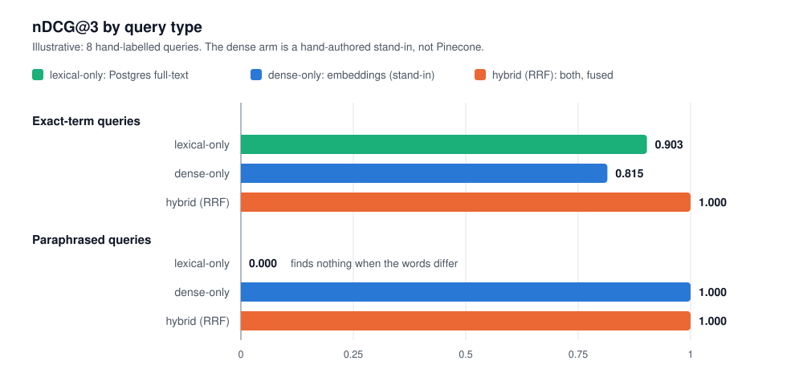

# 🧠 Agentic AI Design

How the multi-agent system works: the graph, what each agent is (and deliberately is not), how tools and retrieval are wired in, and the guardrails that keep it cheap, safe and testable. For the surrounding platform see [ARCHITECTURE.md](ARCHITECTURE.md); for the reasoning behind individual choices see [ENGINEERING_DECISIONS.md](ENGINEERING_DECISIONS.md).

**On this page**

- [The graph](#the-graph)
- [Design principles](#design-principles)
- [State and contracts](#state-and-contracts)
- [Tools and MCP](#tools-and-mcp)
- [Zoning-law RAG](#zoning-law-rag)
- [Retrieval evaluation](#retrieval-evaluation)
- [Guardrails and cost control](#guardrails-and-cost-control)
- [Agents that fail soft](#agents-that-fail-soft)
- [Testing agents without spending money](#testing-agents-without-spending-money)
- [Live UX](#live-ux-for-agent-reasoning)
- [Production hardening](#production-hardening)

---

## The graph

<p align="center">
  <picture>
    <source media="(prefers-color-scheme: dark)" srcset="images/agent-graph-dark.svg">
    
  </picture>
</p>

The topology lives in one small file, [`graph.py`](../graph.py): a `NODE_REGISTRY`, a fan-out edge from the supervisor to each researcher, a fan-in edge from each researcher to the modeler (LangGraph's join waits for all three), and `graph.compile()`.

| # | Agent | Kind | What it does | Code |
|:-:|:--|:--|:--|:--|
| 1 | **Ingest** | LLM, structured output | Extracts `city` and `budget` from free text into a Pydantic model. Instructed to extract only, and not to invent a value that is missing. | [`agents/ingest_input.py`](../agents/ingest_input.py) |
| 2 | **Supervisor** | deterministic | Logs the plan and fans out. **No LLM call**: the routing is static, so a model would add latency, cost and a failure mode while adding no information. | [`agents/supervisor.py`](../agents/supervisor.py) |
| 3a | **Market Data** | API + LLM classifier | Fetches listings through the resilient client, computes count / mean / median / min / max **in Python**, then asks the LLM only to classify two tiers by explicit rules (inventory velocity: `RUSH` / `BALANCED` / `STAGNANT`; price-dispersion risk: `STABLE` / `MODERATE` / `HIGH_VOLATILITY`). | [`agents/market_data.py`](../agents/market_data.py), [`services/market_data_gateway.py`](../services/market_data_gateway.py) |
| 3b | **Neighborhood Vibe** | tool-calling agent | Wikipedia for the macro profile, then OpenStreetMap (sequentially, to respect its rate limits) for transit and amenities. Two or three tool calls, then a structured answer. | [`agents/neighborhood_vibe.py`](../agents/neighborhood_vibe.py) |
| 3c | **Zoning Law** | tool-calling agent | Searches the verified municipal-document index first; falls back to web search only if that is empty or insufficient. Hard budget: one index search, one web search, at most one fetch. | [`agents/zoning_law.py`](../agents/zoning_law.py) |
| 4 | **Financial Modeler** | tool-calling agent | Receives the three typed outputs, calls a `python_repl` tool for cap rate, cash-on-cash and the rest of the arithmetic, and writes the markdown investment memo. | [`agents/financial_modeler.py`](../agents/financial_modeler.py) |

## Design principles

1. **Use an LLM only where judgement is needed.** Parsing free text, classifying, researching with tools and writing prose need a model. Routing, statistics and arithmetic do not, so they are code.
2. **Separate what is computed from what is inferred.** The market agent's output type keeps `telemetry` (untouched API data plus the computed aggregates) apart from `evaluations` (the LLM's classifications), so downstream code and reviewers can always tell a fact from a judgement.
3. **Typed contracts between nodes.** Every hand-off is a Pydantic model, so a malformed model response fails at the boundary, not three nodes later.
4. **Persistence is applied from outside.** Nothing in `agents/` or `graph.py` imports the database. The run recorder wraps the compiled graph with `astream(stream_mode=["debug","updates","values"])` and records what it observes, so the agents stay pure and the dependency arrow points one way.
5. **Every agent is testable offline.** Each node has a mock twin (see [below](#testing-agents-without-spending-money)).

## State and contracts

- `OverallGraphState` ([`schema/state.py`](../schema/state.py)) holds the conversation (`messages`, with LangGraph's `add_messages` reducer) plus five optional nested models, one per agent output. A node returns a *partial* state dictionary; LangGraph merges it.
- Single-shot nodes use `with_structured_output(Model)`; tool-calling agents use `create_agent(..., response_format=Model)`. Either way the result is a validated Pydantic object, never parsed text.
- The public API's request and response models ([`api/v1/schemas.py`](../api/v1/schemas.py)) are **deliberately separate** from graph state, so the HTTP contract does not change every time the graph does.

## Tools and MCP

Tool access goes through a single gateway, [`UnifiedMCPGateway`](../tools/tools.py):

- **Dynamic discovery over MCP.** Servers (Brave Search, Fetch, OpenStreetMap, Wikipedia) are launched over stdio with `uvx` and their tools are discovered at runtime with `langchain-mcp-adapters`. Adding a capability is one entry in `MCP_SERVER_REGISTRY`. Because of `uvx`, a process that runs live agents needs `uv` on its `PATH` (the Docker image includes it; see [GETTING_STARTED.md](GETTING_STARTED.md#going-live-real-models-and-data)).
- **Namespacing.** Tool names are prefixed by server so two servers can never collide.
- **A denylist** drops tools whose schemas are known to break the LLM API.
- **Schema sanitising.** Unsupported JSON-schema fields are stripped before the tools reach the model.
- **Token-safe defaults injected into the schemas.** Fetch length defaults to 2,000 characters (capped at 10,000); web search returns 3 results by default (capped at 5); amenity lookups default to 15 (capped at 30). The model can ask for more, but cannot accidentally ask for a megabyte.
- **Tool errors become messages, not crashes.** `handle_tool_error = True` turns a tool exception into text the model can react to.
- **Agents are built once.** Each tool-calling agent is a lazily created, cached singleton, so MCP discovery is not repeated on every run.

Local tools sit beside the MCP ones: `search_zoning_laws` (Pinecone), `search_zoning_laws_hybrid`, and `python_repl`.

## Zoning-law RAG

### Ingestion

<p align="center">
  <picture>
    <source media="(prefers-color-scheme: dark)" srcset="images/knowledge-base-sync-dark.svg">
    
  </picture>
</p>

- **Chunk parity.** Both indexes are built from the *same* chunks, so a comparison between them means something and their results can be fused by content without inventing an id scheme.
- **Postgres first, unconditionally.** The two indexes are independent failure domains: a Pinecone outage or an open circuit breaker must never leave the lexical index stale. The Postgres table is fully replaced in one transaction, because a resync means "this is everything currently in Azure" (a document removed from the source must disappear from search too), which an incremental upsert cannot express without a stable external id.
- **Overlap-safe.** Beat fires by wall clock, not by "did the last run finish", so the task takes a Redis lock (`SET NX EX`, released by a token-checked compare-and-delete Lua script so one run can never delete a lock a later run legitimately acquired).
- **Pinned embedding model.** `EMBEDDING_MODEL` (default `text-embedding-ada-002`) is an explicit setting, because vectors from different models are not comparable: a library upgrade must never change the model underneath an existing index.
- **Runnable by hand:** `uv run python -m scripts.sync_knowledge_base` (a canned, zero-network summary in offline mode).

### Retrieval: dense by default, hybrid opt-in

The Zoning Law agent uses Pinecone dense search by default. Setting `HYBRID_RETRIEVAL_ENABLED=true` swaps in the hybrid tool so the two can be compared side by side.

<p align="center">
  <picture>
    <source media="(prefers-color-scheme: dark)" srcset="images/hybrid-retrieval-dark.svg">
    
  </picture>
</p>

- **Why the two halves complement each other.** Dense retrieval matches *meaning* and handles paraphrase, but tends to miss a rare exact token such as an ordinance number. Lexical search nails exact terms and returns nothing for a paraphrase. Postgres' `websearch_to_tsquery` also ANDs every bare word together, so a single word absent from a chunk removes it entirely, which is precisely the gap dense search covers.
- **Why rank fusion.** Pinecone's similarity and Postgres' `ts_rank_cd` live on unrelated scales. RRF sums `1 / (k + rank)` over the lists an item appears in, so it never needs the scores to be comparable, which avoids the fragile min-max normalisation and hand-tuned weights of score fusion. `k = 60` is the value from the original RRF paper; larger values flatten the gap between rank 1 and rank 10.
- **Parallel by construction.** The Pinecone call (a blocking SDK call) runs in a worker thread while the Postgres query runs on the event loop, so latency is the maximum of the two, not the sum.
- **Graceful degradation.** Each side is optional. With `vectorstore=None` (not configured, or breaker open) the dense half is skipped without a network call; a genuine failure from either side is reported alongside whatever the other produced.
- **A caveat worth knowing.** The `english` text-search dictionary splits a hyphenated code such as `12-345` into two tokens, and the query is split the same way, so it still matches, but as a phrase of two tokens rather than one atomic code.

## Retrieval evaluation

Retrieval quality is measured, not eyeballed. [`scripts/evaluate_retrieval.py`](../scripts/evaluate_retrieval.py) runs the same set of questions through each retrieval strategy and scores what comes back. Each strategy under test is called an **arm**, the way each treatment in an experiment is an arm:

| Arm | What it does |
|:--|:--|
| **Lexical arm** | Postgres full-text search: matches the *words* in the question |
| **Dense arm** | Pinecone vector search: matches the *meaning* of the question, through embeddings |
| **Hybrid arm** | Runs both and merges the two ranked lists with [Reciprocal Rank Fusion](#retrieval-dense-by-default-hybrid-opt-in) |

The questions are a small **hand-labelled** synthetic set ([`retrieval/eval_dataset.py`](../retrieval/eval_dataset.py)): four **exact-term** queries that quote a code or a number, and four **paraphrased** queries that share few words with their answer. Every arm is scored with three standard metrics ([`retrieval/evaluation.py`](../retrieval/evaluation.py): pure functions with no I/O, binary relevance): **recall@3** (did the right chunk make the top 3?), **MRR** (how high was the first right chunk ranked?) and **nDCG@3** (like MRR, but it credits every right chunk and rewards ranking them higher). Results are broken down by query type, because an overall average hides exactly the failure the harness exists to find.

Without a Pinecone key the dense arm cannot run, so it is reported as unavailable and the hybrid arm degrades to lexical-only, exactly as it does in production. Real output (abridged):

```text
Overall (8 queries)
method                         recall@3      mrr    ndcg@3
lexical-only                      0.438    0.500     0.452
hybrid (dense+lexical, RRF)       0.438    0.500     0.452

Exact-term queries
lexical-only                      0.875    1.000     0.903

Paraphrased queries
lexical-only                      0.000    0.000     0.000
```

The measured finding is the point: **lexical search alone scores exactly zero on paraphrased queries**, the gap that dense retrieval and fusion exist to close. An overall average would have hidden it, which is why the harness reports the per-category breakdown.

**Safe to run any time.** The whole evaluation runs inside one transaction that is *never committed* (a savepoint-joined connection with the app's session singleton temporarily rebound to it), so seeding a synthetic corpus can never overwrite the real, live-synced `document_chunks` table.

### All three arms, side by side (illustrative)

`--demo-dense` swaps the Pinecone arm for a hand-authored, clearly labelled stand-in, so all three arms can be compared without an API key. The lexical arm (real Postgres) and the fusion (the real RRF code) are genuine; only the dense ranking is synthetic. Read the chart as a demonstration of what the harness reports, not as a claim about Pinecone's embeddings, and run with a real, reachable `PINECONE_API_KEY` for genuine dense and hybrid rows.

<p align="center">
  <picture>
    <source media="(prefers-color-scheme: dark)" srcset="images/retrieval-eval-dark.svg">
    
  </picture>
</p>

Each single arm has a blind spot: lexical finds nothing when the words differ, and in this stand-in the dense arm still finds the exact-term answers but not always first. Fusing the two covers both, which is the whole argument for hybrid retrieval. With only eight queries this demonstrates the method; it is not a benchmark.

<details>
<summary>Table view of the same run</summary>

| Query type | Arm | recall@3 | MRR | nDCG@3 |
|:--|:--|--:|--:|--:|
| **Exact-term** (4) | lexical-only | 0.875 | 1.000 | 0.903 |
| | dense-only (stand-in) | 1.000 | 0.750 | 0.815 |
| | hybrid (RRF) | 1.000 | 1.000 | 1.000 |
| **Paraphrased** (4) | lexical-only | 0.000 | 0.000 | 0.000 |
| | dense-only (stand-in) | 1.000 | 1.000 | 1.000 |
| | hybrid (RRF) | 1.000 | 1.000 | 1.000 |
| **Overall** (8) | lexical-only | 0.438 | 0.500 | 0.452 |
| | dense-only (stand-in) | 1.000 | 0.875 | 0.908 |
| | hybrid (RRF) | 1.000 | 1.000 | 1.000 |

</details>

A test pins these numbers to what the harness actually produces ([`tests/test_retrieval_evaluation.py`](../tests/test_retrieval_evaluation.py)), so the table and chart cannot go stale unnoticed.

> **Status.** Hybrid retrieval is opt-in and is tested against a real Postgres with only the Pinecone SDK boundary mocked. It has not yet been exercised against a live Pinecone index in CI.

## Guardrails and cost control

Every control below makes one of two things impossible: an unbounded bill or an unbounded loop. The same controls, written for a non-specialist and with what is still to do, are in [COST_OPTIMIZATION.md](COST_OPTIMIZATION.md).

| Control | Mechanism | Code |
|:--|:--|:--|
| **Offline mode** | `OFFLINE_MODE=true` implies every `MOCK_*` flag. Any path that still attempts a paid call raises `OfflineModeViolation` immediately, naming the caller. | [`config/safety.py`](../config/safety.py) |
| **Guard at the transport seam** | LLM, embedding and vendor clients are built on a guarded `httpx` transport that checks the flag per request, just before bytes would leave the process. | [`config/llm.py`](../config/llm.py), [`config/safety.py`](../config/safety.py) |
| **Recursion limits** | 20 steps for the graph, 10 for each tool-calling agent, so a looping agent cannot spin forever. | [`worker/tasks.py`](../worker/tasks.py), [`agents/`](../agents/) |
| **Search and fetch budgets** | The prompts cap tool calls (zoning: one index search, one web search, at most one fetch; vibe: two or three calls) and define explicit stop conditions. | [`agents/`](../agents/) |
| **Capped tool output** | Token-safe defaults injected into tool schemas (see [Tools and MCP](#tools-and-mcp)). | [`tools/tools.py`](../tools/tools.py) |
| **Small-model default** | Every agent runs `gpt-4o-mini`. | [`config/llm.py`](../config/llm.py) |
| **Caching** | Repeat market lookups cost nothing for 15 minutes; concurrent misses collapse into one vendor call. | [`cache/`](../cache/) |
| **Deterministic paths** | No LLM for routing; statistics in Python; arithmetic in a tool. | [`agents/supervisor.py`](../agents/supervisor.py) |
| **Failure injection** | `TASK_FAILURE_INJECTION_COUNT=N` makes the first N attempts of a job fail, to exercise retry and dead-letter handling on demand. | [`worker/tasks.py`](../worker/tasks.py) |

**Why the guard sits at the HTTP transport.** The alternatives were to monkeypatch `ChatOpenAI.invoke` (but `create_agent` and `with_structured_output` return *new* runnable wrappers with several entry points, so a patch misses paths) or to check the flag once at startup (which catches a configuration mistake but not a code path that forgot to consult a mock flag, the actual failure mode). Every real call, however it is reached, must cross the HTTP client, so that is the one place a guard cannot be bypassed.

**Why the violation fails instantly.** The OpenAI SDK retries plain exceptions raised inside a custom transport and re-raises them as an opaque `APIConnectionError` after several seconds of backoff, which would bury the reason. `OfflineModeViolation` subclasses `openai.OpenAIError`, the one exception type the SDK re-raises untouched.

## Agents that fail soft

Tools return clearly worded, degraded answers when a dependency is unavailable rather than raising. For example, when Pinecone's circuit breaker is open the search tool replies:

> *Zoning law vector search is temporarily unavailable: a circuit breaker opened after repeated Pinecone failures and won't let another call through for about 30s. Use the web search tool for this query instead.*

The Zoning agent's system prompt already treats "no results or insufficient data" as the cue to fall back to web search, so the degraded message plugs straight into a fallback path that exists. The hybrid tool goes further and states which half is missing. The net effect is that an outage lowers answer quality but the graph still completes, and the model, not a stack trace, decides what to do next.

## Testing agents without spending money

- **A mock twin per agent.** Each node is gated by a `MOCK_*` flag and returns a fixture (`tests/fixtures/*.json`) validated against the *same* Pydantic model as the real output, so downstream code is exercised on the true shape.
- **Everything else is stubbed too.** `MOCK_MARKET_DATA_API` fakes the vendor call, `MOCK_KNOWLEDGE_BASE_SYNC` fakes the Azure → Pinecone sync, and the UX-writer LLM has a deterministic offline template. `OFFLINE_MODE` flips all of them.
- **The whole graph runs offline.** `tests/test_offline_graph_run.py` drives the compiled graph end to end; the run recorder, worker, API and SSE tests build on top of that. No network calls, no spend, and CI does the same.
- **What mocks cannot prove.** They keep the shape identical so the plumbing is verified, but they say nothing about model behaviour. That is what the retrieval evaluation harness and real runs are for.

## Live UX for agent reasoning

- Progress events and log lines stream from the worker to the UI, which renders each agent as a live step.
- A small "UX writer" LLM ([`logger/lmm_translator.py`](../logger/lmm_translator.py)) turns raw tool arguments and results into one-line, emoji-led progress messages (temperature 0, structured output), with a deterministic offline stand-in.
- The UI renders purely from the API's event stream. It never imports the graph, so the worker process needs no UI session.

## Production hardening

The gaps below are known and deliberate for a demo, and each has a concrete plan. This is the list to work through before putting real users on the system, roughly in order of risk.

| Area | Today | Why it matters | The plan |
|:--|:--|:--|:--|
| **Code execution** | The Financial Modeler's `python_repl` tool is LangChain's `PythonREPL`: it runs model-written code inside the worker process. Inputs are constrained in this demo. | It is not a sandbox. Prompt injection through fetched web content could in principle steer the model into running arbitrary code with the worker's privileges and environment, API keys included. | Preferably no code execution at all: expose the underwriting formulas (cap rate, cash-on-cash return, debt-service coverage) as typed, deterministic tools, so a wrong argument fails validation instead of running. If open-ended computation is ever needed, run it in an isolated runtime (a gVisor or Firecracker microVM, or a managed code-interpreter sandbox) with no network, no secrets, and CPU and time limits. |
| **Model tiering** | Every LLM call uses `gpt-4o-mini`. The model enum has a `COMPLEX_MODEL` slot, but nothing routes to it. | One model for everything over-spends on easy steps (extraction, classification, progress messages) and under-serves the hardest one, the Financial Modeler's memo. | Route per node through a small config table: a small model for extraction, classification and log summaries, a larger one for the memo. Decide with the evaluation harness and per-run cost accounting, not by feel. |
| **LLM tracing and evals** | The audit trail records each node's status, timing and output, but not prompts, token counts or cost per run. | Cost and quality regressions stay invisible until a bill or a user reports them. | LangSmith or Arize Phoenix (OpenTelemetry GenAI spans) for traces and for tokens and cost per run, with evaluation runs as a CI gate. |
| **Self-critique** | Nothing validates the final report against the original request. | An off-brief or unsupported report is returned as if it were fine. | A bounded critic node that checks the report against the request and the typed sources, allowing at most one revision. |
| **Live-index tests** | Hybrid retrieval is tested against a real Postgres with only the Pinecone SDK boundary mocked; it has not run against a live index in CI. | A behavioural difference in the real service would be invisible to CI. | A small dedicated test index, exercised on a schedule rather than on every push. |
| **Provider fallback** | One LLM provider. | A provider outage or rate limit stops every run. | Fallbacks behind the same interface (another hosted model, or a local one), with the circuit breaker deciding when to switch. |

**Already closed:** the embedding model is an explicit, documented setting (`EMBEDDING_MODEL`, default `text-embedding-ada-002`, the model the index was built with), so a library upgrade can no longer change it underneath an existing index. Changing it on purpose means re-embedding into a new index and switching over.
