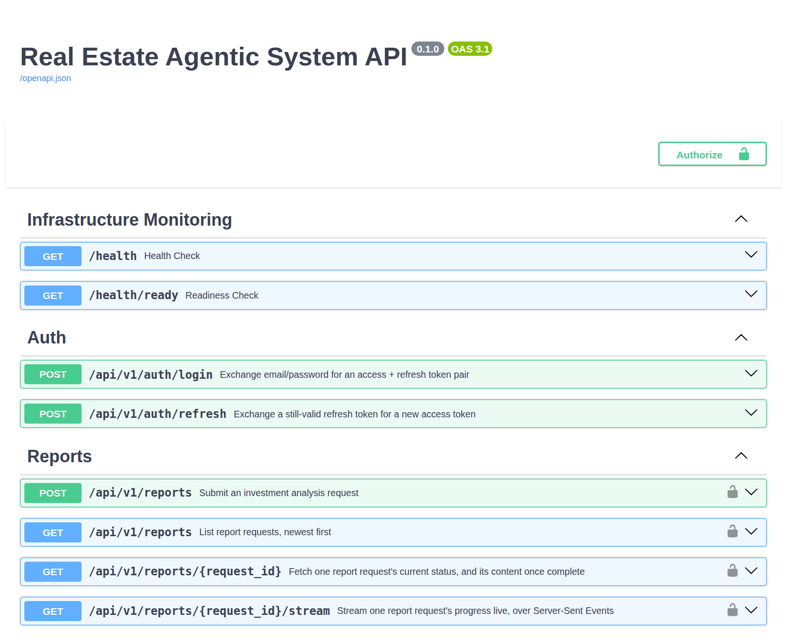

# 🔌 API Reference

The public HTTP surface, served under `/api/v1`. The Chainlit UI uses exactly this API, so everything below is exercised on every run.

Examples assume the stack from the [README quickstart](../README.md#quickstart) is running on `http://localhost:8080` (in offline mode, so they cost nothing). The transcripts shown were captured from that setup.

**On this page**

- [Interactive documentation](#interactive-documentation)
- [Endpoints](#endpoints)
- [Authentication](#authentication)
- [Creating a report](#creating-a-report)
- [Idempotency](#idempotency)
- [Rate limiting](#rate-limiting)
- [Live progress over SSE](#live-progress-over-sse)
- [Status codes](#status-codes)
- [Health probes](#health-probes)
- [End-to-end walkthrough](#end-to-end-walkthrough)

---

## Interactive documentation

FastAPI builds the interactive docs from the route definitions **at run time**, so the repository contains no Swagger file. While the stack is running they are served at:

- **Swagger UI:** <http://localhost:8080/docs> (ReDoc, a read-only view, is at `/redoc`)
- **The raw OpenAPI schema:** <http://localhost:8080/openapi.json>

To read the contract without starting anything, a snapshot of the schema is committed as [`openapi.json`](openapi.json). It imports straight into Postman or a code generator. A test fails if the snapshot drifts from the code; regenerate it with `uv run python -m scripts.export_openapi`.

This is what `/docs` shows (captured from the running app):

<p align="center">
  
</p>

## Endpoints

| Method | Path | Purpose | Auth |
|:--|:--|:--|:--|
| `POST` | `/api/v1/auth/login` | Exchange email + password for an access and refresh token | none |
| `POST` | `/api/v1/auth/refresh` | Exchange a refresh token for a new access token | refresh token in body |
| `POST` | `/api/v1/reports` | Submit an investment request; returns immediately with a job id | JWT or API key |
| `GET` | `/api/v1/reports/{id}` | Job status, and the finished report once completed | JWT or API key |
| `GET` | `/api/v1/reports` | Your jobs, newest first (`limit` 1-100, default 20; `offset`) | JWT or API key |
| `GET` | `/api/v1/reports/{id}/stream` | Live progress as Server-Sent Events | JWT or API key |
| `GET` | `/health`, `/health/ready` | Liveness and readiness probes | none |

All errors are JSON: `{"detail": "<message>"}`.

## Authentication

**Users (JWT).** `POST /api/v1/auth/login` with a JSON body returns a token pair. Send the access token as `Authorization: Bearer <token>`.

```bash
curl -s localhost:8080/api/v1/auth/login -H 'Content-Type: application/json' \
  -d '{"email":"demo@realestateapp.local","password":"demo-password-123"}'
# {"access_token":"eyJhbGciOi…","refresh_token":"eyJhbGciOi…","token_type":"bearer"}
```

- Access tokens live 15 minutes, refresh tokens 7 days; both are HS256 JWTs carrying a `type` claim, so a refresh token cannot be used as an access token.
- `POST /api/v1/auth/refresh` with `{"refresh_token": "…"}` returns a new access token. Refresh tokens are not rotated (see [ENGINEERING_DECISIONS.md](ENGINEERING_DECISIONS.md#17-jwt-access--refresh-verified-statelessly-hashed-with-bcrypt)).
- There is no self-registration: users are seeded by migration. The credentials above belong to the seeded **local demo user** and only work against a stack you run yourself.
- Every authentication failure is the same `401`, whether the token is missing, expired, malformed or of the wrong type, and a wrong email looks identical to a wrong password.

**Machines (API key).** Set `SERVICE_API_KEYS` (comma-separated) and send `X-API-Key: <key>` instead of a JWT. Keys are compared in constant time and authenticate as the seeded demo user. With no key configured, no key authenticates anything.

## Creating a report

```bash
curl -s -i localhost:8080/api/v1/reports \
  -H "Authorization: Bearer $TOKEN" \
  -H 'Content-Type: application/json' \
  -H "Idempotency-Key: $(date +%s)" \
  -d '{"query":"Find me a multi-family investment in Austin, TX under $900k"}'
```

```http
HTTP/1.1 202 Accepted
location: http://localhost:8080/api/v1/reports/8042312e-cf34-472e-8eac-4faf5ab958f5
x-ratelimit-limit: 20
x-ratelimit-remaining: 18
x-ratelimit-reset: 1

{"id":"8042312e-cf34-472e-8eac-4faf5ab958f5","status":"pending","status_url":"http://localhost:8080/api/v1/reports/8042312e-cf34-472e-8eac-4faf5ab958f5"}
```

- `query` is free text, 1 to 2,000 characters; the Ingest agent extracts the city and budget from it.
- `Idempotency-Key` is **required** (1 to 255 characters) and scoped to the authenticated user.
- The call does one idempotent insert and one enqueue, so it returns in milliseconds while the work runs in the background. Follow `Location` / `status_url`, or [stream the progress](#live-progress-over-sse).
- `GET /api/v1/reports/{id}` returns `status` (`pending`, `running`, `completed`, `failed`), the extracted `city` and `budget`, timestamps, and, once completed, a `report` object: the markdown `content` plus `total_listings`, `average_price`, `median_price`, `highest_listing` and `lowest_listing` (decimals, never floats). Another user's job returns `404`, never `403`.

## Idempotency

`POST` is not idempotent by definition; the `Idempotency-Key` header restores safe retries (a network timeout, a double-click, a retrying proxy).

| Situation | Response | What happens |
|:--|:--|:--|
| New key | `202 Accepted` | job created and enqueued |
| Same key, **same** body | `200 OK` | replay: the original job's *current* status; no new work |
| Same key, **different** body | `409 Conflict` | the key no longer identifies one request |
| Header missing | `422` | rejected before any application code runs |

- The body is fingerprinted with SHA-256 at claim time and compared on replay; the raw text is not stored a second time.
- Replaying a job that has **not** finished re-enqueues its task (the original enqueue may never have reached the broker). This is safe because the worker's atomic claim refuses a second run; see [ARCHITECTURE.md](ARCHITECTURE.md#exactly-once-effect-on-at-least-once-delivery).

```bash
# Same key, different body:
curl -s -w '\nHTTP %{http_code}\n' localhost:8080/api/v1/reports -H "Authorization: Bearer $TOKEN" \
  -H 'Content-Type: application/json' -H 'Idempotency-Key: demo-key-1' -d '{"query":"something else entirely"}'
# {"detail":"Idempotency-Key already used with a different request body."}
# HTTP 409
```

## Rate limiting

A per-identity **token bucket** in Redis guards every report route: by default a burst of 20 requests, refilling at 2 per second (`RATE_LIMIT_BUCKET_CAPACITY`, `RATE_LIMIT_REFILL_PER_SECOND`). Every response carries the state, and an empty bucket returns `429`:

```http
HTTP/1.1 429 Too Many Requests
retry-after: 1
x-ratelimit-limit: 20
x-ratelimit-remaining: 0
x-ratelimit-reset: 1

{"detail":"Rate limit exceeded."}
```

| Header | Meaning |
|:--|:--|
| `X-RateLimit-Limit` | bucket capacity |
| `X-RateLimit-Remaining` | whole tokens left |
| `X-RateLimit-Reset` | seconds until the bucket is full again |
| `Retry-After` | (`429` only) minimum seconds before a retry can succeed; at least 1 |

The headers are exposed through CORS, so browser clients can implement back-off. Login and refresh are deliberately not limited by this dependency (there is no identity before a login succeeds).

## Live progress over SSE

`GET /api/v1/reports/{id}/stream` returns `text/event-stream`. Four event types, then the stream ends:

| Event | When | Payload |
|:--|:--|:--|
| `snapshot` | once, on connect | `{"agent_runs":[{node, status, started_at, completed_at, error_message}…]}` rebuilt from Postgres, so a late subscriber still sees the whole run |
| `progress` | a node starts or finishes | `schema_version`, `request_id`, `node`, `status`, `timestamp`, a strictly increasing per-run `sequence`, `error_message` |
| `log` | a human-readable line from an agent | `type: "log"`, `node`, `message`, `timestamp` |
| `status` | once, at the end | `{"id", "status"}`, the job-level outcome; the stream then closes |

While idle the server sends a `: heartbeat` comment every 15 seconds to keep proxies from timing the connection out. A comment line is invisible to `EventSource` and never reaches a listener.

Captured from a real run (abridged; `curl -N` keeps the connection open):

```bash
curl -N -H "Authorization: Bearer $TOKEN" localhost:8080/api/v1/reports/$ID/stream
```

```text
event: snapshot
data: {"agent_runs":[]}

event: progress
data: {"schema_version":1,"request_id":"50c65ffe-…","node":"ingest_input_agent","status":"running","timestamp":"2026-09-29T11:54:30.532153Z","sequence":1,"error_message":null}

event: progress
data: {"schema_version":1,"request_id":"50c65ffe-…","node":"ingest_input_agent","status":"completed","timestamp":"2026-09-29T11:54:30.550390Z","sequence":2,"error_message":null}

  … supervisor_agent running / completed (sequence 3, 4) …

event: progress
data: {"schema_version":1,"request_id":"50c65ffe-…","node":"market_data_agent","status":"running","timestamp":"2026-09-29T11:54:30.563540Z","sequence":5,"error_message":null}

event: progress
data: {"schema_version":1,"request_id":"50c65ffe-…","node":"neighborhood_vibe_agent","status":"running","timestamp":"2026-09-29T11:54:30.563540Z","sequence":6,"error_message":null}

event: progress
data: {"schema_version":1,"request_id":"50c65ffe-…","node":"zoning_law_agent","status":"running","timestamp":"2026-09-29T11:54:30.563540Z","sequence":7,"error_message":null}

  … completions, then financial_modeler_agent running / completed (sequence 8 to 12) …

event: status
data: {"id":"50c65ffe-…","status":"completed"}
```

Sequences 5, 6 and 7 carry **the same timestamp**: the three researchers were dispatched together by the graph's fan-out, on the wire, not just in a diagram. A full run publishes twelve `progress` events (a start and an end for each of the six agents); the interleaved `log` events are omitted above.

A stream opened *after* the job finished still behaves sensibly: it sends the snapshot and then `status` immediately. If the events Redis is unreachable, opening a stream fails with `500` before any bytes are sent, rather than starting a stream that could never deliver.

## Status codes

| Code | Where | Meaning |
|:-:|:--|:--|
| `200` | `POST /reports`, `GET` routes | replay of an existing job, or a successful read |
| `202` | `POST /reports` | new job accepted; work is running in the background |
| `401` | any protected route | missing, expired, malformed or wrong-type credentials (deliberately uniform) |
| `404` | `GET /reports/{id}` and `/stream` | no such job **or** not yours (never a `403`, so existence is not leaked) |
| `409` | `POST /reports` | `Idempotency-Key` reused with a different body |
| `422` | any route | validation failure: missing `Idempotency-Key`, empty or oversize `query`, bad paging values |
| `429` | report routes | rate limit exceeded; see `Retry-After` |
| `503` | report routes | persistence is switched off (`DB_PERSISTENCE_ENABLED=false`); the API has no synchronous fallback to offer |

## Health probes

| Path | Answers | Notes |
|:--|:--|:--|
| `GET /health` | *is the process alive?* | does no I/O: `{"status":"healthy"}` |
| `GET /health/ready` | *can this instance do its job right now?* | queries Postgres each call: `{"status":"ready","database":"reachable"}`, or `503` |
| `GET /nginx-health` | *is the proxy alive?* | answered by NGINX itself, never proxied, so "proxy down" never means "app down" |

Liveness and readiness are different questions with different consequences: a failing liveness probe restarts a process, while a failing readiness probe only removes it from rotation.

## End-to-end walkthrough

Requires `curl` and [`jq`](https://jqlang.github.io/jq/).

```bash
B=http://localhost:8080

# 1. Log in and keep the access token
TOKEN=$(curl -s $B/api/v1/auth/login -H 'Content-Type: application/json' \
  -d '{"email":"demo@realestateapp.local","password":"demo-password-123"}' | jq -r .access_token)

# 2. Submit a job (returns 202 in milliseconds)
ID=$(curl -s $B/api/v1/reports -H "Authorization: Bearer $TOKEN" \
  -H 'Content-Type: application/json' -H "Idempotency-Key: demo-$(date +%s)" \
  -d '{"query":"Denver, CO under $700k"}' | jq -r .id)

# 3. Watch the agents work, live
curl -N -H "Authorization: Bearer $TOKEN" $B/api/v1/reports/$ID/stream

# 4. Fetch the finished report
curl -s -H "Authorization: Bearer $TOKEN" $B/api/v1/reports/$ID | jq '{status, city, budget, report: .report.content}'

# 5. List your jobs, newest first
curl -s -H "Authorization: Bearer $TOKEN" "$B/api/v1/reports?limit=5" | jq '.items[] | {id, status, city}'
```

In offline mode the agents return deterministic mock data (the city and budget in the report come from a fixture, not from your `query`), which is what makes the whole flow free to explore. With real keys and `OFFLINE_MODE=false` the same calls run the live agents; see [GETTING_STARTED.md](GETTING_STARTED.md).
