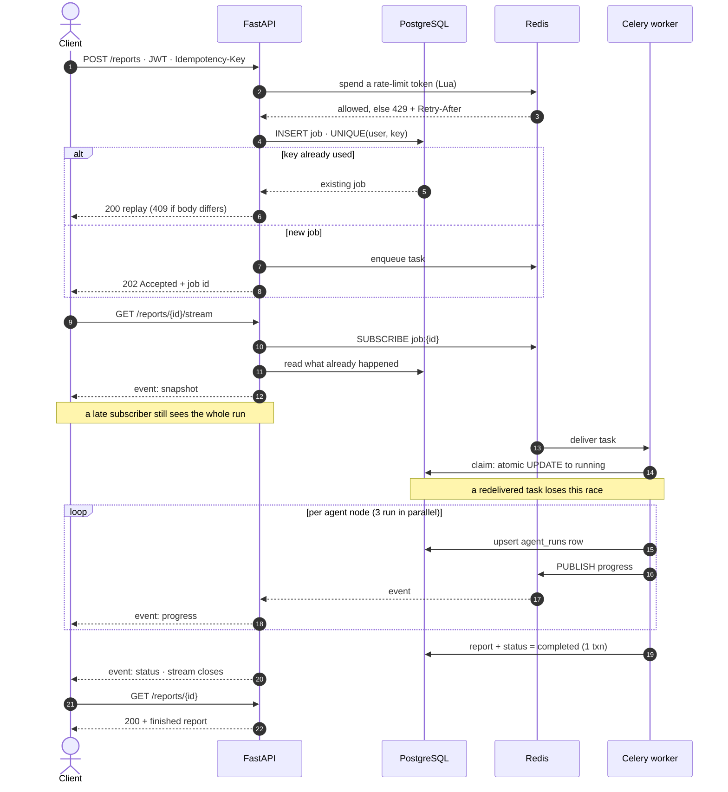
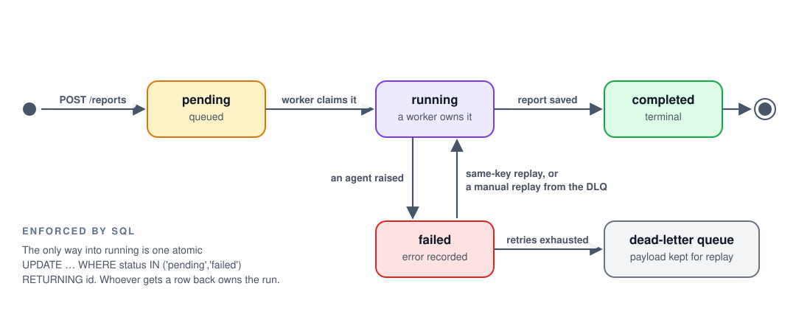
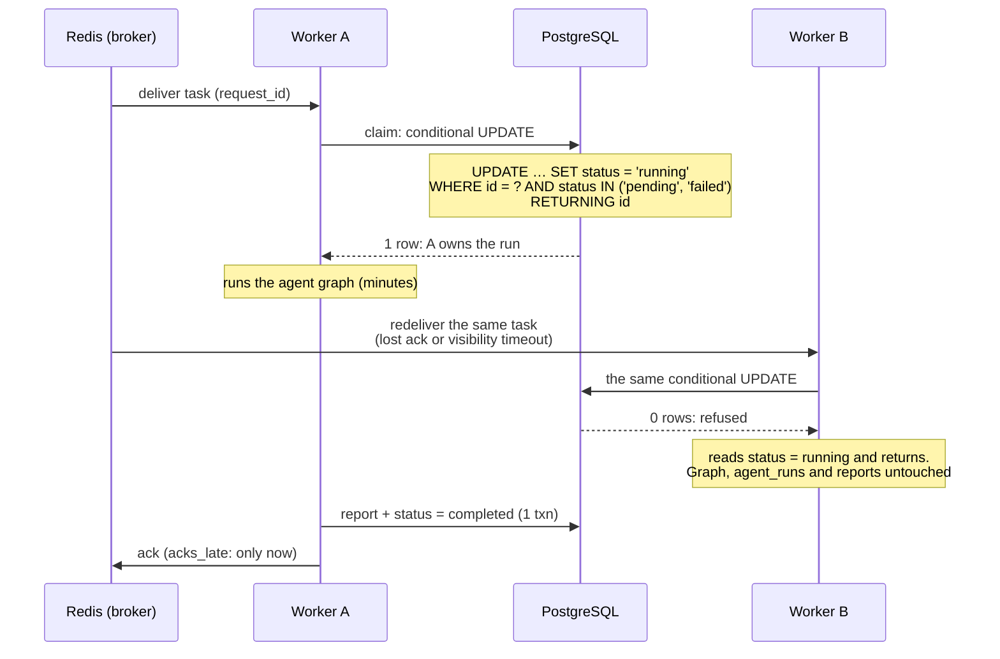
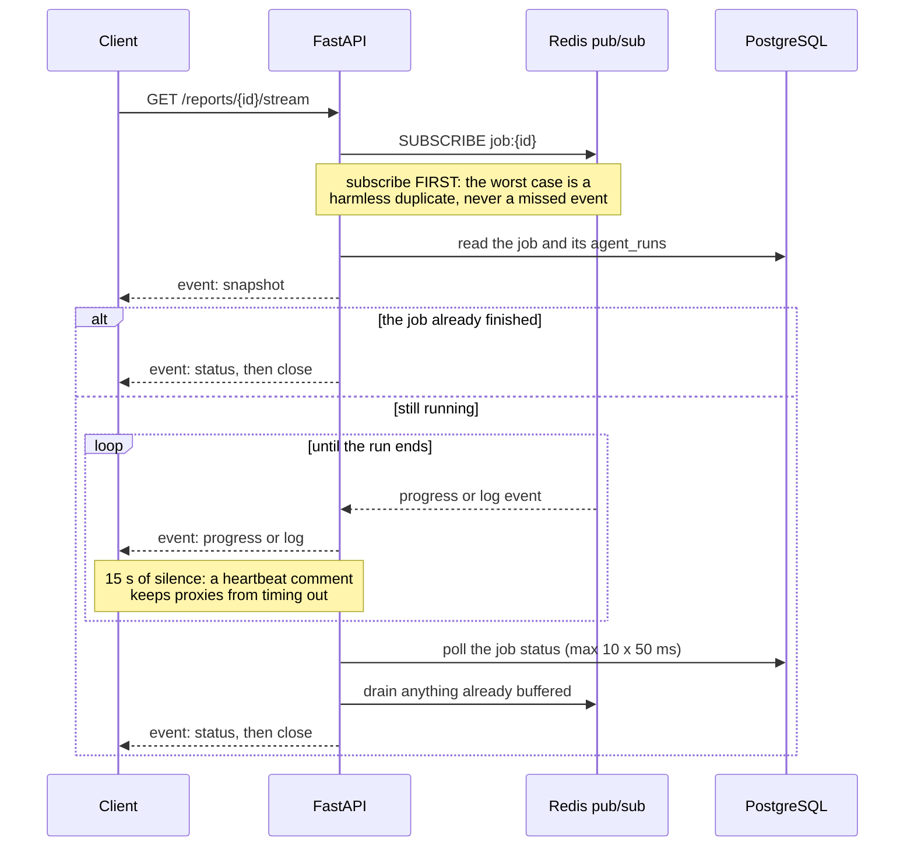
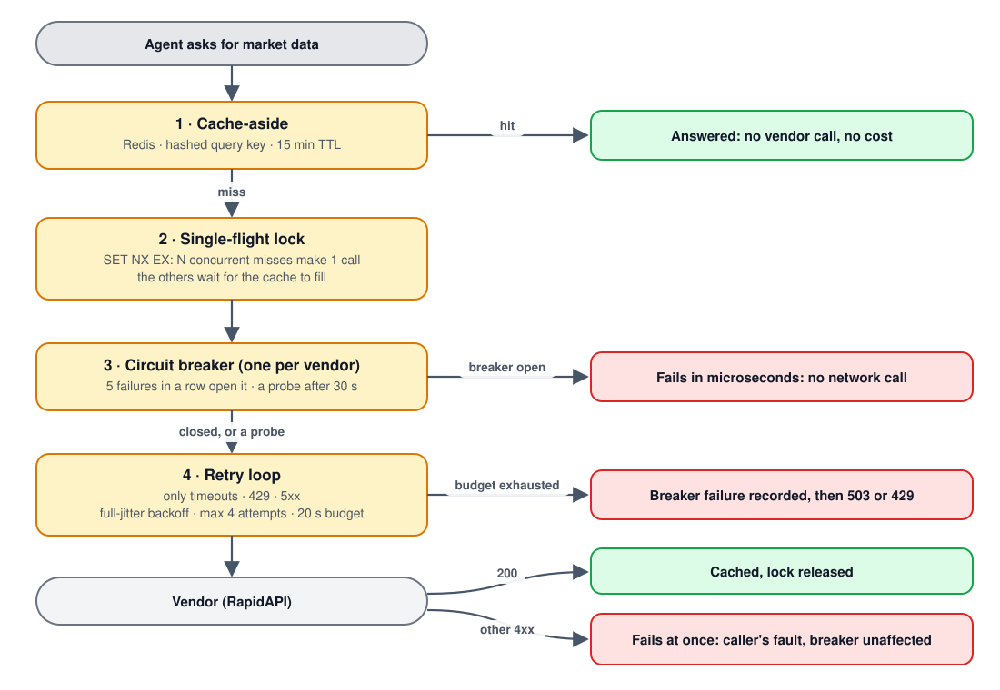
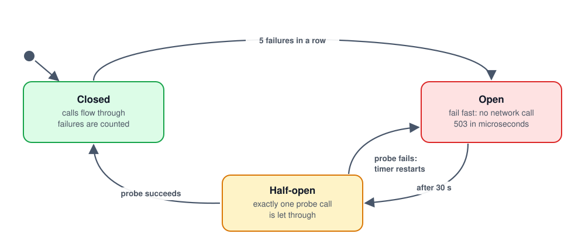
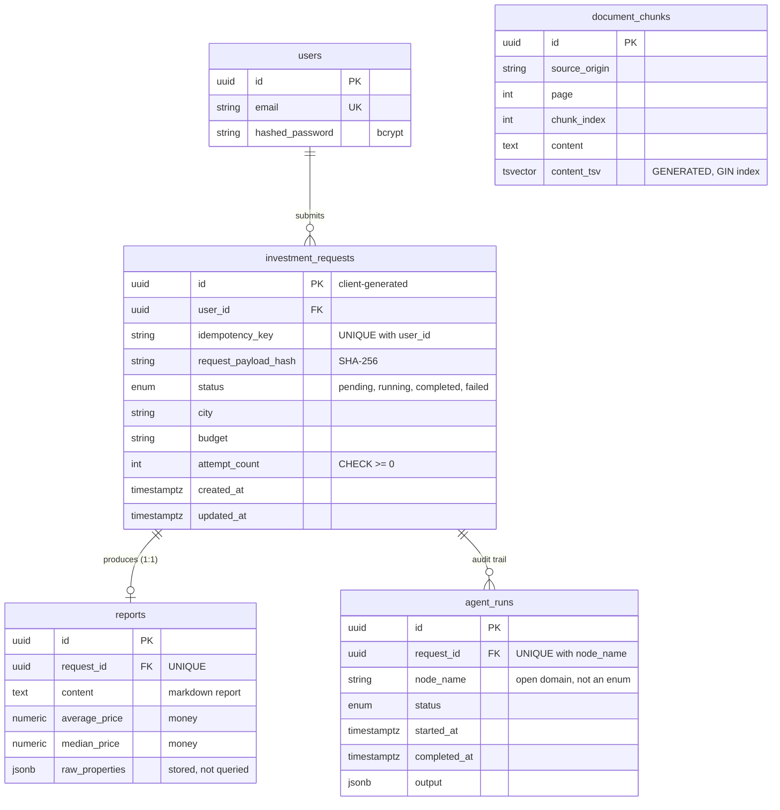
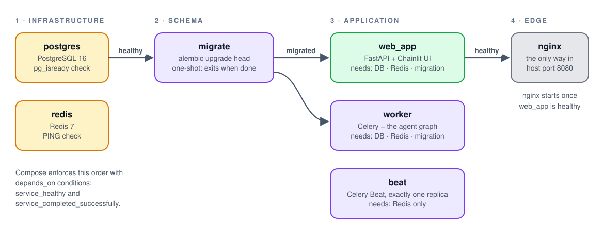
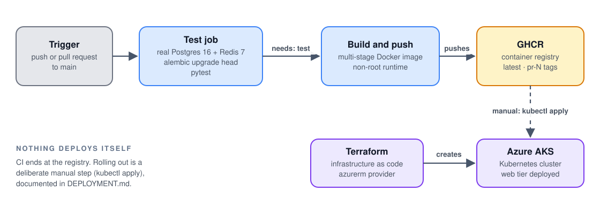

# 🏛️ Architecture

How the Real Estate AI Investment Planner is put together, and why. This is the deep dive behind the picture at the top of the [README](../README.md). For the multi-agent design itself see [AGENTIC_AI.md](AGENTIC_AI.md); for the reasoning behind individual choices (and what was rejected) see [ENGINEERING_DECISIONS.md](ENGINEERING_DECISIONS.md).

**On this page**

- [System overview](#system-overview)
- [Components](#components)
- [Request lifecycle](#request-lifecycle)
- [Job lifecycle](#job-lifecycle)
- [Exactly-once effect](#exactly-once-effect-on-at-least-once-delivery)
- [Live progress](#live-progress-with-server-sent-events)
- [Reliability](#reliability)
- [Data model](#data-model)
- [Redis layout](#redis-layout)
- [Security model](#security-model)
- [Delivery](#delivery)
- [Known limitations](#known-limitations)

---

## System overview

The system is split along one line: the **request path** (fast, stateless) and the **work path** (slow, expensive, retryable). They never call each other. They coordinate through two shared stores that have deliberately different jobs.

  <picture>
    <source media="(prefers-color-scheme: dark)" srcset="images/architecture-dark.svg">
    
  </picture>

Five principles shape everything else:

1. **The API never runs an agent.** `POST /api/v1/reports` does one idempotent `INSERT` and one enqueue, then returns `202`. A multi-minute LLM run cannot exhaust web workers, and a slow run cannot make an API call time out.
2. **Postgres is the source of truth; Redis is scaffolding.** Jobs, reports and the per-agent audit trail are durable in Postgres. Redis holds only what can be lost without losing a job: queue messages (the job still sits `pending` in Postgres, and a same-key replay re-enqueues it), pub/sub events, cache entries, rate-limit buckets and locks.
3. **Fail loudly where correctness depends on it; fail soft where it doesn't.** The database and the rate limiter fail loudly (a limiter that fails open is defeated exactly when it is needed). Progress events and log lines fail soft (a lost notification must never abort a paid, multi-minute run).
4. **Every boundary is safe to retry.** Client → API is protected by idempotency keys, broker → worker by an atomic claim, worker → vendor by jittered retries behind a circuit breaker.
5. **The UI has no privileged path.** The Chainlit UI logs in with a JWT and submits and streams through `/api/v1` like any other client, so the public API is exercised on every run rather than being decorative.

## Components

| Component | Responsibility | Code |
|:--|:--|:--|
| **NGINX** | Front door. Per-path proxy rules: SSE unbuffered, WebSocket upgrade, DNS re-resolved per request | [`nginx/default.conf`](../nginx/default.conf) |
| **FastAPI app** | Versioned REST API, OpenAPI/Swagger, health probes, lifespan-managed pools with fail-fast startup checks | [`server.py`](../server.py), [`api/v1/`](../api/v1/) |
| **Auth** | JWT access/refresh tokens, bcrypt password hashing, service API keys | [`auth/`](../auth/) |
| **Rate limiter** | Redis token bucket as one atomic Lua script | [`rate_limit/`](../rate_limit/) |
| **Run recorder** | Wraps the graph from the outside: idempotent claim, atomic run-claim, per-node audit rows, event publishing | [`orchestration/run_recorder.py`](../orchestration/run_recorder.py) |
| **Worker + Beat** | Celery app, `generate_report` task (retries, dead-letter queue), scheduled knowledge-base sync | [`worker/`](../worker/) |
| **Events** | Versioned progress-event schema, Redis pub/sub publisher | [`events/`](../events/) |
| **Persistence** | SQLAlchemy 2.0 async models, repositories, Alembic migrations | [`db/`](../db/), [`alembic/`](../alembic/) |
| **Resilience** | Full-jitter retries, per-upstream circuit breakers, cache-aside with single-flight lock | [`services/`](../services/), [`resilience/`](../resilience/), [`cache/`](../cache/) |
| **Agents** | LangGraph topology, six nodes, MCP gateway, RAG tools, hybrid retrieval | [`graph.py`](../graph.py), [`agents/`](../agents/), [`tools/`](../tools/), [`retrieval/`](../retrieval/) |
| **UI** | Chainlit chat UI (an API client), log-to-UX translation | [`app.py`](../app.py), [`logger/`](../logger/), [`services/report_api_client.py`](../services/report_api_client.py) |
| **Delivery** | Multi-stage Dockerfile, Compose stack, CI, Terraform, Kubernetes manifests | [`Dockerfile`](../Dockerfile), [`docker-compose.yml`](../docker-compose.yml), [`.github/workflows/`](../.github/workflows/), [`terraform/`](../terraform/), [`k8s/`](../k8s/) |

## Request lifecycle

One report request, from `POST` to finished report:

What matters in that picture:

- **Guards run in a fixed order.** `_require_persistence` → `get_current_caller` (JWT *or* API key) → `enforce_rate_limit`. FastAPI resolves dependencies left to right and stops at the first exception, so an environment with persistence switched off answers a clear `503` instead of a misleading authentication error, and the rate limiter can key its bucket by the *resolved identity* because authentication has already run. ([`api/v1/reports.py`](../api/v1/reports.py))
- **The job id exists before any work starts.** Primary keys are client-generated UUIDs, so the API knows the id at `INSERT` time, returns it immediately, and hands it to Celery as a plain argument. No round trip is needed to learn it.
- **Replay semantics are deliberate.** Same key and same body → `200` with the original job (no new work). Same key with a *different* body → `409`, detected by comparing a SHA-256 fingerprint of the request stored at claim time. A replay of a job that has not finished re-enqueues the task, because the original enqueue may never have reached the broker; the worker-side atomic claim (below) is what makes that safe.
- **Nothing holds a database transaction across the agent run.** Every write is its own short unit of work.
- **The report and the terminal status commit together.** No caller can ever observe a report without a `completed` job, or the reverse.

## Job lifecycle

  <picture>
    <source media="(prefers-color-scheme: dark)" srcset="images/job-lifecycle-dark.svg">
    
  </picture>

- **The state machine is enforced by SQL, not by application `if`s.** The only way into `running` is `UPDATE … WHERE status IN ('pending','failed') RETURNING id`; whichever caller gets a row back owns the run.
- **Agent failures and infrastructure failures take different paths.** An exception *inside* the graph is caught by the run recorder: the unfinished nodes are marked `failed` with the error text, the job becomes `failed`, and the task returns normally (the failure is visible live over SSE). An exception *outside* it (a dropped database connection, a Redis blip) escapes to Celery, which retries with exponential backoff and jitter, and after the last retry marks the job `failed` and parks the task on a dead-letter queue with its original payload so it can be inspected or replayed.
- **`agent_runs` is a durable audit trail.** One row per node per request (`UNIQUE(request_id, node_name)`, written with `INSERT … ON CONFLICT DO UPDATE`), holding status, start and end time, error message and the node's output as JSONB. It also drives the SSE snapshot.
- **Parallel nodes share one `started_at`.** The recorder keys the timestamp by LangGraph *superstep*, not by event, so the three researchers dispatched together record one identical start time (visible in the live stream, see [API.md](API.md#live-progress-over-sse)).

## Exactly-once effect on at-least-once delivery

A broker can promise *at-least-once* delivery, never exactly-once. With `task_acks_late=True` a task is acknowledged only after it finishes, so a worker that dies takes nothing with it (the task is redelivered), but a lost acknowledgement or a slow task can deliver the same message twice, even to two workers at the same moment. The goal is therefore exactly-once **effect**, and it is achieved in layers, each closing a different gap:

| Layer | Mechanism | Stops |
|:--|:--|:--|
| **API** | `Idempotency-Key` header + `UNIQUE(user_id, idempotency_key)` | a retried or double-submitted `POST` creating a second job |
| **Enqueue** | the job is claimed *before* it is enqueued; the task carries the claimed id | losing or duplicating the link between a job and its task |
| **Worker** | `try_claim_run()`, one conditional `UPDATE … RETURNING` | a redelivered task running six paid agents a second time |

**Why the database arbitrates.** A read-then-branch check (`if status == COMPLETED: skip`) handles a redelivery that arrives *after* the first run finished, but not the harder case: a redelivery racing a run that is still in progress. Only a single atomic statement that the database serialises can decide between two truly concurrent callers, which is also why the idempotent claim is an `INSERT` that catches `IntegrityError` rather than a `SELECT` followed by an `INSERT`. Both are covered by real two-connection race tests (`asyncio.gather` over separate connections), not just sequential ones. A Redis lock around the run was rejected: it would create a second source of truth for "who owns this job" that can disagree with the row.

> **Known gap.** The claim only leaves from `pending`/`failed`, so a worker that is hard-killed mid-run (SIGKILL, OOM, node loss) leaves the job `running` and nothing reclaims it. Excluding `running` is exactly what makes concurrent-redelivery safety possible; the price is that recovery from a hard kill needs a lease with a heartbeat plus a reaper, which is not built yet. Graceful shutdown (SIGTERM → drain in-flight work) prevents it in normal operation; see [Delivery](#delivery).

## Live progress with Server-Sent Events

Progress reaches the browser as a stream: workers publish to Redis, the API subscribes and forwards.

- **Snapshot, then live.** Pub/sub is ephemeral: a message published to nobody is gone. A client that connects late (or reconnects) first receives an `event: snapshot` rebuilt from Postgres, so it can render the whole run. Subscribing *before* reading the snapshot can only produce a harmless duplicate; the reverse order would open a window in which an event is lost.
- **The job's end is read from the database, never inferred.** A per-node `completed` event does not mean the *job* is done, and inferring it from "the last node finished" would couple the endpoint to the graph's topology. The endpoint polls `investment_requests.status` briefly after a terminal node event, then drains anything already buffered on the connection, then emits a single `event: status` and closes.
- **Heartbeats.** After 15 s of silence the stream sends a `: heartbeat` comment line (ignored by `EventSource`) so proxies and load balancers do not time out an idle connection during a long agent step.
- **Clean teardown.** A client disconnect releases the subscription promptly (checked every heartbeat interval, and again through Starlette's disconnect handling).
- **Events are versioned** (`schema_version`) and carry a per-run, strictly increasing `sequence`.
- **NGINX treats the stream specially**: `proxy_buffering off`, `proxy_cache off`, `proxy_next_upstream off` (replaying half a stream would duplicate events) and a read timeout sized to the app's overall report deadline. Ordinary API calls keep NGINX's default buffering.
- **SSE, not WebSockets.** Data flows one way. WebSockets are used only by Chainlit's own socket for the chat UI. [`scripts/compare_polling_sse.py`](../scripts/compare_polling_sse.py) measures short polling against SSE watching the same run.

## Reliability

Every call to a paid third party passes through the same stack of small mechanisms, each of which removes one failure mode before it reaches the next:

  <picture>
    <source media="(prefers-color-scheme: dark)" srcset="images/resilient-vendor-call-dark.svg">
    
  </picture>

- **Retries alone make an outage worse.** Callers hammering a struggling vendor add load exactly when it can least take it (retry amplification). The breaker is what turns "every call burns a full retry budget" into "every call fails in microseconds".
- **Retry only what is transient.** Timeouts, connection errors, `429` and `5xx` are retried; any other `4xx` means the request itself was wrong and fails on the first attempt. Backoff uses tenacity's `wait_random_exponential` (AWS-style "full jitter"), so many callers backing off from one outage do not retry in lockstep, and *two* stop conditions (attempts **and** elapsed time) bound the total.
- **Only "the vendor looks unhealthy" trips a breaker.** A caller's own bad request is never counted, so one malformed request can't open a breaker that then blocks every valid caller. A failed half-open probe re-opens immediately rather than counting from zero.

  <picture>
    <source media="(prefers-color-scheme: dark)" srcset="images/circuit-breaker-dark.svg">
    
  </picture>

- **One breaker per upstream, never one global.** RapidAPI's is keyed by its base URL; Pinecone's is a single named breaker shared by the read path (agent search) and the write path (scheduled sync), since both hit the same index. Breakers are hand-written (one small module, no dependency), in-memory and process-local: their job is to stop *this* process hammering a dead upstream, which needs no cross-replica agreement (unlike the rate limiter).
- **Cache invalidation is TTL, deliberately.** Nothing in the app writes fresh market data independently of a read, so there is no event to invalidate on, only staleness to bound (15 minutes). A failed fetch is never cached.

### What happens when something fails

| Failure | Behavior | Why |
|:--|:--|:--|
| Postgres unreachable at boot | API refuses to start (`SELECT 1` in the lifespan) | a process that boots healthy but records nothing is worse than a crash loop |
| Redis unreachable at boot | API refuses to start (`PING`) | the rate limiter is a hard dependency |
| Redis fails in the rate limiter at request time | the request errors; it never fails *open* | a limiter that fails open is defeated exactly when it is needed |
| Redis pub/sub fails during a run | the run continues; the event is dropped | the durable `agent_runs` row is already committed; a lost notification must not abort a paid run |
| Redis unreachable when a client opens the stream | `500` before any bytes are sent | fail loudly instead of starting a stream that can never deliver |
| Vendor timeout / `429` / `5xx` | jittered retries (≤ 4 attempts, ≤ 20 s), then breaker failure | absorb blips without amplifying an outage |
| Vendor breaker open | immediate `503`, no network call | protect the vendor and the caller's latency |
| Pinecone down or its breaker open | dense-only tool returns a *degraded message* and the agent falls back to web search; hybrid tool answers from Postgres and says so | the model adapts in-band instead of the graph crashing |
| Postgres full-text search fails (hybrid mode) | dense-only results, with a notice to the agent | one half of retrieval never blocks the other |
| Agent raises inside the graph | job `failed`, unfinished nodes marked with the error, visible live | failures are data, not lost logs |
| Task raises outside the graph (infra) | Celery retries ×3 with exponential backoff + jitter (1 s → 8 s), then `failed` + dead-letter queue | poison messages are parked with their payload, not retried forever |
| Broker redelivers a task | atomic claim refuses the second run | exactly-once effect |
| Client retries a `POST` | same `Idempotency-Key` → `200` replay, no second job | safe retries |
| Same key, different body | `409` | the key no longer identifies one request |
| Rate limit exceeded | `429` + `Retry-After` + `X-RateLimit-*` | clients can back off correctly |
| `SIGTERM` to worker or API | in-flight work drains first (330 s grace period: Compose for every service, Kubernetes for the web tier) | no job left half-done by a routine deploy |
| Worker hard-killed mid-run | job stays `running` (see [known gap](#exactly-once-effect-on-at-least-once-delivery)) | not yet handled |

## Data model

Every constraint and index is there for a reason ([`db/models.py`](../db/models.py)):

- **`UNIQUE(user_id, idempotency_key)`** scopes idempotency per user and is the constraint the idempotent claim relies on.
- **Composite index `(user_id, created_at DESC)`** serves "my requests, newest first" and also covers the foreign key (Postgres, unlike MySQL/InnoDB, does not index foreign keys automatically).
- **Partial index on `status IN ('pending','running')`** indexes only the small, constantly changing active slice, not the ever-growing history.
- **`UNIQUE(request_id)`** on `reports` makes the relationship 1:1; **`UNIQUE(request_id, node_name)`** on `agent_runs` makes the upsert idempotent under re-execution.
- **`Numeric(14,2)` for money**, never float. **JSONB only for what is stored but never queried** (`raw_properties`, a node's `output`); everything queried is a real column.
- **Native enum for a closed domain** (job status), **`VARCHAR` for an open one** (node names change with the graph's topology and would otherwise need an `ALTER TYPE` per change).
- **`content_tsv` is a `GENERATED ALWAYS … STORED` column** with a GIN index, so Postgres itself keeps full-text search in sync on every write.
- **Client-generated UUID keys and `TIMESTAMPTZ` everywhere.**
- **Migrations are Alembic revisions** (five so far), with a deterministic constraint-naming convention so later `ALTER`s are reliable. The seeded demo user is a separate *data* migration that duplicates its literals instead of importing app constants, since a migration is a frozen historical artifact. A drift test compares the models against the migrated schema on every test run.

## Redis layout

One Redis server, five logical databases, so a queue inspection or a cache flush scoped to one concern can never see or wipe another's keys:

| DB | Purpose | Client code | Notes |
|:-:|:--|:--|:--|
| 0 | Celery broker (+ the knowledge-base sync lock) | [`worker/celery_app.py`](../worker/celery_app.py) | pending tasks are plain list pushes with no TTL |
| 1 | Celery results | [`worker/celery_app.py`](../worker/celery_app.py) | expire after 1 h |
| 2 | Rate-limit buckets | [`rate_limit/`](../rate_limit/) | `ratelimit:<identity>`, refreshed TTL |
| 3 | Progress events | [`events/`](../events/) | pub/sub channels `job:{id}` (channels are not keys) |
| 4 | Market-data cache | [`cache/`](../cache/) | entries with TTL, single-flight lock keys, hit/miss counters |

Compose runs Redis with `--maxmemory 256mb --maxmemory-policy volatile-lru`. Eviction policy is **server-wide**, not per logical database, so `allkeys-lru` could evict a pending broker message. `volatile-lru` can only evict keys that have an expiry, and broker queue entries have none, so they are structurally safe; everything it *can* evict (a rate-limit bucket, an old result, a cache entry) degrades gracefully when lost.

## Security model

| Concern | What is implemented |
|:--|:--|
| **Authentication** | JWT access (15 min) and refresh (7 days) tokens, HS256, with a `type` claim so a refresh token can never be used as an access token; passwords hashed with bcrypt; users are seeded by migration (no self-registration endpoint) |
| **Service callers** | `X-API-Key` header checked with a constant-time comparison; falls through to JWT handling unchanged |
| **Authorization** | every read is scoped to the caller's user id; another user's job is a `404`, not a `403`, so existence is never leaked; every auth failure is the same `401` |
| **CORS** | explicit origin allow-list, never `*` (the app refuses to start if `*` is configured, because credentialed requests cannot use a wildcard) |
| **Abuse and cost** | per-identity token-bucket rate limit (default 20-token burst, refilling 2/s) and an offline mode that blocks paid calls entirely |
| **Secrets** | never committed (`.env` is git-ignored); Kubernetes secrets for the deployment; the container runs as a non-root numeric UID |
| **Serialization** | Celery uses JSON only (no pickle, which can execute code on deserialization) |

## Delivery

**Compose** starts the whole system. Startup order is encoded in `depends_on` conditions: the database schema is migrated by a one-shot service that every database client waits for, so a fresh volume gets its tables before anything queries them, and a failed migration stops the stack loudly instead of leaving an app on a half-migrated schema. The web app is not published to the host: NGINX is the only way in to the application (Postgres and Redis do publish their ports, for local tooling and the test suite).

  <picture>
    <source media="(prefers-color-scheme: dark)" srcset="images/compose-startup-dark.svg">
    
  </picture>

**The image** is built in two stages from the same slim base: a builder installs the locked production dependencies into a virtualenv; the runtime stage copies only that venv and the code. The runtime image contains no pytest and no build caches, only the standalone `uv`/`uvx` binaries (the agents launch their MCP tool servers with `uvx`), and runs as a fixed numeric non-root UID (so a Kubernetes `runAsNonRoot` check can verify it). Layers are ordered so a code-only change reuses the dependency layer.

**NGINX** ([`nginx/default.conf`](../nginx/default.conf)) is layer-7 on purpose: it applies different rules per path. The SSE location is unbuffered; `/ws/` forwards the WebSocket upgrade with long timeouts; everything else is ordinarily buffered. The upstream is addressed through a variable plus Docker's DNS resolver so it is re-resolved per request: a plain `upstream` block pins the container's IP at startup, and recreating `web_app` would then turn every request into a `502` until NGINX itself is restarted.

**CI** ([`.github/workflows/deploy.yml`](../.github/workflows/deploy.yml)) tests against *real* Postgres 16 and Redis 7 service containers and only then builds and pushes the image:

  <picture>
    <source media="(prefers-color-scheme: dark)" srcset="images/ci-cd-pipeline-dark.svg">
    
  </picture>

### Cloud and Kubernetes

The application is shaped for an orchestrator, and the repository carries the infrastructure to run its web tier on Azure Kubernetes Service (AKS). What exists, and what a production high-availability setup would add:

| Concern | In this repository | For production high availability |
|:--|:--|:--|
| **Cluster** | [`terraform/`](../terraform/) provisions an AKS cluster with a managed identity and a Standard load balancer, into a pre-existing resource group (so a teardown never touches the blob storage holding the RAG documents). Deliberately cost-minimal: one small node (2 vCPU, 8 GiB), autoscaling off, no availability zones. | Three or more nodes across availability zones, separate system and user node pools, the cluster autoscaler, and Terraform state in a remote backend with locking. |
| **Web tier** | [`k8s/`](../k8s/) holds a Deployment (CPU and memory requests and limits, secrets through `secretKeyRef` so a missing key fails the pod at creation, a 330 s termination grace period matched to the longest in-flight wait) and a `LoadBalancer` Service with client-IP session affinity (Chainlit's socket needs sticky sessions once there is more than one replica). | More than one replica, a HorizontalPodAutoscaler, a PodDisruptionBudget, topology spread across zones, and the probes wired in: the app already serves `/health` (liveness) and `/health/ready` (readiness), the manifest does not reference them yet. |
| **Workers** | Celery worker and Beat run under Compose. | A worker Deployment scaled on queue depth (for example with KEDA) and a Beat Deployment pinned to exactly one replica; migrations as a Job or init container, as the one-shot `migrate` service does in Compose. |
| **State** | PostgreSQL and Redis run as Compose containers. | Managed, zone-redundant services: Azure Database for PostgreSQL Flexible Server and Azure Cache for Redis. |
| **Secrets and delivery** | CI builds the image and pushes it to GHCR; rolling out is a deliberate manual `kubectl apply`; secrets come from a local env file into a Kubernetes Secret. | Azure Key Vault with workload identity, images pinned by digest instead of `:latest`, and GitOps (Argo CD or Flux) instead of a manual apply. |
| **Edge** | A public `LoadBalancer` Service. | An ingress controller with TLS (cert-manager), network policies and a WAF. |
| **Cost control** | `az aks stop` hibernates the cluster to zero compute cost when idle; see the runbook. | Right-sized node pools, spot nodes for stateless workers, autoscaling with a floor. |

Already orchestrator-friendly in the code: a stateless web tier (all state is in Postgres and Redis), liveness and readiness endpoints, graceful `SIGTERM` draining, a fixed non-root UID that a `runAsNonRoot` check can verify, environment-only configuration, a one-shot migration step, and a scheduler that is explicitly a single replica. The operational runbook is [DEPLOYMENT.md](DEPLOYMENT.md).

**Graceful shutdown.** Celery's warm shutdown and uvicorn's graceful shutdown both already wait for in-flight work on a single `SIGTERM`, so no custom signal code was needed. The real ceiling is whatever sends the signal: Compose's and Kubernetes' default grace periods (10 s / 30 s) would `SIGKILL` a multi-minute run, so both are set to 330 s, derived from the app's own 300 s report deadline plus cleanup headroom.

## Known limitations

Stated plainly, with the direction each would take:

- **Hard-killed workers leave a job `running`.** Needs a lease/heartbeat and a stale-job reaper.
- **The Kubernetes manifests cover the web tier only.** The full system (Redis, Postgres, worker, Beat) runs via Docker Compose; standing the rest up on AKS is the step described in [Cloud and Kubernetes](#cloud-and-kubernetes).
- **No TLS at the edge, no edge rate limiting, and client IPs are not propagated** (`--proxy-headers`) behind NGINX yet.
- **Refresh tokens are not rotated or revocable.** Rotation without a server-side record of used tokens would invalidate nothing while implying it does, so it was deliberately not faked; a `jti` denylist is the real fix.
- **Circuit breakers are per-process**, so each replica learns of an outage independently.
- **Observability is logs plus the audit trail.** There is no distributed tracing, metrics or SLO dashboard yet (see the README's *What's next*).
- **Single seeded user.** By design for a demo; API keys authenticate as that user.
